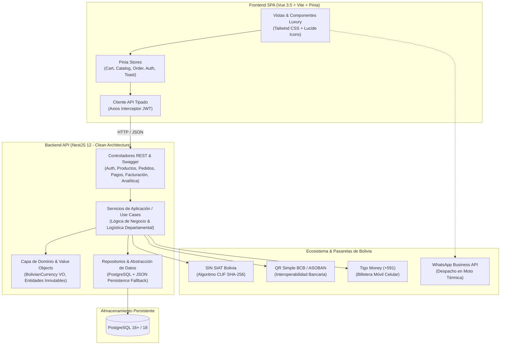

# 🥖 Panadería & Pastelería "La Suprema Boliviana"
### Monorepo Empresarial de Clase Mundial (NestJS 12 + Vue 3.5 + PostgreSQL + Docker) 🇧🇴

[](https://github.com/ArielCusipumaOrtega/PANADERIA-LA-SUPREMA-BOLIVIANA-SISTEMA-DE-CLASE-MUNDIAL/actions)


---

## 📖 Visión del Proyecto

**La Suprema Boliviana** es una plataforma omnicanal de comercio electrónico, gestión de producción en hornos de solera y facturación tributaria computarizada diseñada específicamente para el mercado boliviano. 

Combina la riqueza ancestral del pan cocido sobre piedra refractaria con los estándares más rigurosos de **Arquitectura Limpia**, **Domain-Driven Design (DDD)**, diseño visual **Sober Luxury** y cumplimiento tributario oficial del **Servicio de Impuestos Nacionales (SIN)** con cobertura logística en los **9 departamentos de Bolivia**.

---

## 🏛️ Arquitectura del Sistema

El monorepo sigue los principios de separación de responsabilidades y tipado estricto extremo:



---

## 🌟 Principales Innovaciones & Módulos

### 1. 🥖 Gastronomía Boliviana Auténtica & Ficha Técnica de Maridaje
- **Catálogo Gourmet:** Marraqueta Paceña tradicional cocida a la piedra viva, Cuñapé cruceño con queso chaqueño curado y almidón de yuca, Pan de Arani cochabambino con canela y queso criollo, Sarnitas altiplánicas, Empanadas blanqueadas tarijeñas maceradas en Singani de altura, y panes de Quinua Real andina.
- **Ficha Técnica & Maridajes:** Modal interactivo con tiempo de fermentación lenta (hasta 24 horas), tipo de horno de solera, vida fresca y sugerencias de maridaje tradicional boliviano (*Café de los Yungas paceños, Api morado caliente, Tojorí andino o Singani Los Parrales*).

### 2. 🧾 Facturación Computarizada en Línea SIAT (SIN Bolivia)
- Generación automatizada de **CUF (Código Único de Facturación)** de 48 caracteres mediante algoritmo oficial SHA-256.
- Control de **CUFD (Código Único de Facturación Diario)** por departamento.
- Renderizado de **Código QR Tributario oficial** verificado ante Impuestos Nacionales.
- Cumplimiento normativo estricto de la **Ley N° 453**.
- Formato de impresión directa optimizado (`@media print`) para hoja completa o ticket térmico de 80 mm.

### 3. 💳 Pasarela Multi-Riel de Pagos Bolivianos
- **QR Simple BCB Interoperable:** Generación dinámica con solapa interactiva de bancos nacionales (**Banco Unión, BCP, BNB, BancoSol, Banco BISA, Banco Ganadero**), botones de copiado de glosa/monto y simulación de aprobación en tiempo real con confeti.
- **Tigo Money (+591):** Débito a billetera móvil mediante número celular y notificación push.
- **Efectivo contra Entrega:** Selector de cambio para el repartidor (*Monto Exacto, Billete de Bs. 100, Billete de Bs. 200*).
- **Tarjeta Débito/Crédito Red Enlace:** Formulario con encriptación AES-256 y verificación de seguridad bancaria.

### 4. 🗺️ Red de Boutiques en los 9 Departamentos
- Cobertura física y logística en **La Paz, Santa Cruz, Cochabamba, Chuquisaca, Tarija, Oruro, Potosí, Beni y Pando**.
- Filtros por macro-regiones (*Altiplano & Cordillera, Valles Fértiles, Llanos & Amazonía*) con datos de altitud sobre el nivel del mar.
- **Monitor de Turnos de Horneada en Vivo:** Detección de hora local boliviana (UTC-4) con estado en tiempo real (*Horneada al Alba, Horneada del Lonche, Horneada Nocturna*).
- Enlaces directos a **WhatsApp de la boutique**, geolocalización en **Google Maps** y click-to-call.

### 5. 🛵 Rastreo de Pedidos en 5 Fases de Solera
- Stepper visual e interactivo:
  1. *Pedido Confirmado & Receta Asignada*
  2. *En Solera de Horneada (240°C a la piedra)*
  3. *Reposo en Canasto & Empacado Térmico*
  4. *En Camino con Despacho Express en Moto Térmica (30-45 min)*
  5. *Entregado en Mano con Factura SIAT*
- Botón de contacto directo por WhatsApp al repartidor con resumen de canasta y dirección.

### 6. 📊 Tablero Gerencial de Producción & Control de Mermas
- **Cinta Ejecutiva de KPIs:** Facturación bruta en Bolivianos, ticket promedio, piezas horneadas y porcentaje de merma técnica.
- **Control Técnico de Mermas:** Supervisión de tolerancia (< 3%) por rotura de corteza o exceso de vapor en solera.
- **Lotes de Hornada en Vivo (`LOT-...`):** Temperatura del horno a la piedra (220°C - 240°C), turno, piezas planeadas vs. obtenidas y maestro panadero a cargo.
- **Inventario de Insumos Andinos:** Monitor de harina especial 000, queso chaqueño, manteca de cerdo, singani y levadura madre con alertas de reposición crítica.

### 7. 🎨 Sistema de Diseño 'Sober Luxury'
- Paleta intencional de alta gama: Obsidiana profunda (`#0A0908`), Carbón mineral (`#14120E`), Acentos en Oro viejo (`#C5A03A`) y Lienzo crema cálido (`#FAF8F5`).
- Tipografía editorial: **Playfair Display** (elegancia histórica) + **Plus Jakarta Sans** (legibilidad y agilidad transaccional) + **JetBrains Mono** (datos financieros y fiscales).
- Sistema de notificaciones flotantes Luxury Toast con `<TransitionGroup>`.
- Slide-over Cart Drawer interactivo con cálculo dinámico de flete departamental.

---

## 📂 Organización del Monorepo

```
panaderia-la-suprema-boliviana-sistema-de-clase-mundial/
├── package.json                         # Orquestador del Monorepo (NPM Workspaces)
├── docker-compose.yml                   # Stack completo: PostgreSQL + NestJS + Vue/Nginx
├── .env.example                         # Plantilla de variables de entorno globales
├── .github/workflows/ci.yml             # Pipeline de CI (Linting, Compilación y Tests)
│
├── backend/                             # API RESTful en NestJS 12 (Clean Architecture)
│   ├── src/
│   │   ├── common/                      # Value Objects (BolivianCurrency VO), Guards, Decorators
│   │   ├── database/                    # Conexión PostgreSQL (pg pool) y persistencia JSON fallback
│   │   ├── modules/
│   │   │   ├── auth/                    # JWT Authentication, Argon2, roles (Admin, Panadero, Cajero)
│   │   │   ├── products/                # Catálogo de panes bolivianos y control de stock
│   │   │   ├── branches/                # Boutiques en los 9 departamentos de Bolivia
│   │   │   ├── orders/                  # Pedidos omnicanal y cálculo de flete nacional
│   │   │   ├── payments/                # Pasarela QR Simple BCB, Tigo Money y confirmación
│   │   │   ├── billing/                 # Facturación electrónica SIAT con algoritmo CUF
│   │   │   ├── production/              # Lotes de horneada en piedra y control de mermas
│   │   │   ├── analytics/               # Métricas de ventas en Bs. y arqueo de caja
│   │   │   └── health/                  # Health check y estado del sistema
│   │   ├── app.module.ts
│   │   └── main.ts                      # Bootstrap con Swagger OpenAPI y validación global
│   ├── test/                            # Pruebas automatizadas y unit testing
│   ├── Dockerfile                       # Contenedor Node.js optimizado multi-stage
│   └── package.json                     # @panaderia-bolivia/backend
│
└── frontend/                            # SPA Reactiva en Vue.js 3.5 + Vite 6 + Tailwind CSS
    ├── src/
    │   ├── views/
    │   │   ├── HomeView.vue             # Catálogo interactivo, hero editorial y filtros
    │   │   ├── BranchesView.vue         # Boutiques en los 9 departamentos y turnos de horneada
    │   │   ├── CheckoutView.vue         # Finalización de pedido y pasarela boliviana
    │   │   ├── OrderTrackingView.vue    # Rastreador de pedidos con stepper de 5 pasos
    │   │   └── DashboardView.vue        # Consola ejecutiva de ventas, lotes y mermas
    │   ├── components/
    │   │   ├── Navbar.vue               # Barra de navegación con indicador de conexión
    │   │   ├── Footer.vue               # Pie editorial con sellos de garantía y NIT
    │   │   ├── CartDrawer.vue           # Panel deslizante de canasta y flete en vivo
    │   │   ├── ProductDetailModal.vue   # Ficha técnica artesanal y maridajes bolivianos
    │   │   ├── QrPaymentModal.vue       # Hub de pago interactivo (QR, Tigo Money, Tarjeta, Efectivo)
    │   │   ├── InvoiceModal.vue         # Factura computarizada oficial SIAT / SIN
    │   │   ├── ToastContainer.vue       # Sistema flotante de alertas y notificaciones luxury
    │   │   └── AuthModal.vue            # Modal de autenticación y registro
    │   ├── stores/                      # Pinia Stores (cart, catalog, order, auth, toast)
    │   ├── services/                    # Cliente Axios configurado con interceptores JWT
    │   └── types/                       # Interfaces TypeScript compartidas
    ├── Dockerfile                       # Contenedor Nginx estático con compresión gzip
    └── package.json                     # @panaderia-bolivia/frontend
```

---

## ⚡ Puesta en Marcha Rápida (Local)

### Prerrequisitos
- **Node.js:** v20.x o superior
- **NPM:** v10.x o superior
- **PostgreSQL:** v16+ (opcional si se utiliza la persistencia de contingencia local) o **Docker**.

### 1. Clonar el Repositorio
```bash
git clone https://github.com/ArielCusipumaOrtega/panaderia-la-suprema-boliviana-sistema-de-clase-mundial.git
cd panaderia-la-suprema-boliviana-sistema-de-clase-mundial
```

### 2. Instalar Dependencias del Monorepo
```bash
npm install
```

### 3. Configurar Entorno
Copia el archivo de plantilla a la raíz y al backend:
```bash
cp .env.example .env
cp .env.example backend/.env
```

Configura tus credenciales en `backend/.env` (por defecto se conecta a PostgreSQL o usa contingencia):
```env
PORT=3000
NODE_ENV=development
DB_HOST=localhost
DB_PORT=5432
DB_USERNAME=usr_panaderia_la_suprema
DB_PASSWORD=123456
DB_NAME=panaderia_la_suprema
JWT_SECRET=SECRETO_PANADERIA_BOLIVIANA_CLASE_MUNDIAL_2026
```

### 4. Ejecutar Backend y Frontend en Simultáneo
```bash
npm run dev
```

La consola orquestará ambos servicios en paralelo con etiquetas de color:
- 🌐 **Frontend (Vue 3 + Vite):** [http://localhost:5173/](http://localhost:5173/)
- 🔌 **Backend REST API (NestJS):** [http://localhost:3000/api](http://localhost:3000/api)
- 📑 **Documentación Swagger UI:** [http://localhost:3000/api/docs](http://localhost:3000/api/docs)
- 🩺 **Health Check en Vivo:** [http://localhost:3000/api/health](http://localhost:3000/api/health)

---

## 🐳 Despliegue con Docker Compose (Recomendado para Producción)

Para desplegar la infraestructura completa con un solo comando:

```bash
docker compose up -d --build
```

Servicios desplegados:
- **Frontend Nginx:** `http://localhost/` (Puerto 80 con proxy reverso hacia API)
- **Backend NestJS:** `http://localhost:3000/api`
- **PostgreSQL Database:** `localhost:5432`

---

## 🧪 Comandos y Scripts del Monorepo

| Comando | Descripción |
| :--- | :--- |
| `npm run dev` | Inicia simultáneamente Backend (NestJS) y Frontend (Vite) en modo desarrollo |
| `npm run dev:backend` | Inicia únicamente el servidor backend con recarga en caliente |
| `npm run dev:frontend` | Inicia únicamente el servidor de desarrollo del frontend |
| `npm run build` | Compila el backend TypeScript (`nest build`) y el frontend Vue (`vue-tsc -b && vite build`) |
| `npm run lint` | Ejecuta Oxlint en los workspaces de backend y frontend (**0 errores, 0 advertencias garantizadas**) |
| `npm run test` | Ejecuta la suite de pruebas unitarias automatizadas del backend |
| `npm run test:e2e` | Ejecuta las pruebas de integración End-to-End |

---

## 🔐 Cuentas de Acceso Rápido para Demostraciones

| Rol | Correo Electrónico | Contraseña | Capacidades |
| :--- | :--- | :--- | :--- |
| **Administrador General** | `admin@panaderia.bo` | `Admin123!` | Control de finanzas, auditoría de sucursales, facturación SIAT y configuración |
| **Maestro Panadero** | `panadero@panaderia.bo` | `Pan123!` | Planificación de hornadas, recetas, control de temperatura y registro de mermas |
| **Cajero de Sucursal** | `cajero@panaderia.bo` | `Cajero123!` | Arqueo y cierre de caja diario, cobros en mostrador y emisión de facturas |
| **Cliente Gourmet** | `cliente@gmail.com` | `Cliente123!` | Catálogo, canasta con flete nacional, pagos multi-riel y rastreo de pedido |

---

## 📜 Licencia & Reconocimientos

Este proyecto está distribuido bajo la licencia **MIT**. Desarrollado con devoción artesanal y rigor de ingeniería para representar lo mejor del software y la gastronomía de Bolivia al mundo 🇧🇴.
